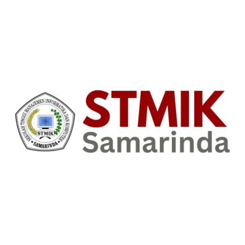

<p align="center"><a href="https://siakad-pt.idev-fun.org" target="_blank"></a></p>

<p align="center">
<a href="changelog.md"> Siakad | v2.0 - Changelogs</a>
<br>
<span>Latest Update: 13 Juni 2025</span>


## Status Pengembangan
> **Catatan Penting**: Proyek ini sedang dalam proses re-adaptasi total dan migrasi ke source code baru. Saat ini, fitur-fitur berikut yang sudah berfungsi penuh:
> - Dashboard/Home
> - Manajemen Profil
> - Sistem Absensi
> - Manajemen Data Master Akademik ( Done )
> - Manajemen Data Master Pengguna ( Done )
> - Manajemen Data Master Publikasi ( Done )
> - Manajemen Data Master PMB ( Done )
> - Manajemen Data Master Infrastruktur ( Done )
> - Manajemen Data Master Keuangan ( Progress )
> - Manajemen Data Master Pendaftaran ( Done Merge with MASTER PMB )
>
> Fitur-fitur lainnya masih dalam tahap pengembangan dan akan diimplementasikan secara bertahap.

## Preview Images

<p align="center">Halaman Utama</p>
<hr>

<p align="center">Halaman Login Authentikasi</p>
<hr>

<p align="center">Halaman Profile User</p>

## Tentang Siakad
 Siakad — lahir dari sebuah visi untuk menyatukan semua aplikasi dan layanan penting kampus yang selama ini terpisah-pisah ke dalam satu platform digital yang terintegrasi dan mudah digunakan. Bayangkan kemudahan mengelola pendataan infrastruktur, pembayaran kuliah, absensi dosen dan mahasiswa, e-learning, serta layanan akademik lainnya secara terpusat dalam satu sistem: itulah ekosistem baru yang hadirkan.

saya memahami bahwa banyak perguruan tinggi mengalami kesulitan karena sistem yang tersebar dan biaya tinggi untuk berbagai vendor berbeda. Dengan Siakad ini, saya ingin memberikan solusi yang tidak hanya efisien dan lancar, tapi juga berkualitas tinggi dan lebih terjangkau. Semua ini dibangun di atas teknologi modern Laravel 12 yang handal, dengan fokus pada keamanan, skalabilitas, dan kemudahan penggunaan untuk seluruh civitas akademika.

## Fitur yang Sudah Tersedia

### Staff / Karyawan
1. **Dashboard Admin** ✅
   - Statistik real-time
   - Grafik kinerja
   - Notifikasi sistem

2. **Manajemen Profil** ✅
   - Edit informasi pribadi
   - Manajemen akun dan keamanan
   - Upload dan update foto profil
   - Riwayat aktivitas

3. **Menu Rutinitas** 🔄
   - Absensi harian (Check-in/Check-out) ✅
   - Manajemen izin dan cuti ✅
   - Support ticket online 🔄

4. **Menu Akademik** ✅
   - Manajemen Tahun Akademik
   - Manajemen Fakultas
   - Manajemen Program Studi
   - Manajemen Kurikulum
   - Manajemen MataKuliah
   - Manajemen Jenis Kelas
   - Manajemen Kelas
   - Manajemen Waktu Kuliah
   - Manajemen Jadwal Kuliah

6. **Menu Publikasi** ✅
   - Manajemen Kategori
   - Manajemen Berita
   - Manajemen Pengumuman

8. **Menu Pengguna** ✅
   - Manajemen Staff
   - Manajemen Mahasiswa
   - Manajemen Dosen

9. **Menu Infrastruktur** ✅
   - Manajemen Gedung
   - Manajemen Ruang

10. **Sistem Log Aktivitas** ✅
    - Pencatatan otomatis aksi Create, Update, Delete pada model yang diaktifkan.
    - Pelacakan detail perubahan data (nilai lama dan baru).
    - Penyimpanan log yang efisien menggunakan Queue.
    - Antarmuka untuk melihat, memfilter, dan menghapus log aktivitas.


### Dosen ✅
1. **Dashboard Dosen**
   - Jadwal mengajar
   - Statistik kehadiran
   - Notifikasi tugas

2. **Manajemen Profil**
   - Edit data pribadi
   - Ubah password
   - Upload foto profil

3. **Menu Akademik**
   - Jadwal perkuliahan
   - Manajemen absensi
   - Penilaian tugas
   - Feedback mahasiswa

### Mahasiswa ✅
1. **Dashboard Mahasiswa**
   - Jadwal kuliah
   - Status kehadiran
   - Notifikasi tugas

2. **Manajemen Profil**
   - Edit data pribadi
   - Ubah password
   - Upload foto profil

3. **Menu Akademik**
   - Absensi online
   - Pengumpulan tugas
   - Feedback dosen

4. **Menu Finansial**
   - Tagihan online
   - Pembayaran digital
   - Riwayat transaksi

5. **Menu Bantuan**
   - Support ticket
   - FAQ
   - Panduan sistem

> **Keterangan Status**:
> - ✅ Fitur sudah tersedia dan berfungsi penuh
> - 🔄 Fitur dalam tahap pengembangan
> - ⏳ Fitur akan segera diimplementasikan

## Sistem Log Aktivitas

Sistem log aktivitas di Neco Siakad dirancang untuk mencatat dan melacak perubahan penting yang terjadi pada data dalam aplikasi. Ini membantu dalam audit, pemecahan masalah, dan memahami aktivitas pengguna.

**Cara Kerja:**

Sistem ini menggunakan PHP Trait `HasLogAktivitas` yang ditambahkan ke model Eloquent. Ketika sebuah model yang menggunakan trait ini dibuat, diperbarui, atau dihapus, event terkait (Eloquent events) akan memicu proses logging secara otomatis.

Untuk model dengan banyak kolom atau data besar, proses logging dilakukan secara asinkron melalui **Queue** untuk menghindari beban berlebih pada request HTTP dan mencegah error memori.

**Data yang Dicatat:**

Setiap entri log aktivitas mencatat informasi berikut:

*   **User:** Pengguna yang melakukan tindakan (Administrator, Mahasiswa, atau Dosen), beserta tipe dan ID-nya.
*   **Aksi:** Jenis tindakan yang dilakukan (Membuat, Mengubah, Menghapus).
*   **Model:** Model Eloquent yang terpengaruh oleh aksi (misalnya, `App\Models\Akademik\Fakultas`, `App\Models\User`, dll.), beserta ID objek model tersebut.
*   **Perubahan Data:** Untuk aksi 'Mengubah', sistem mencatat detail setiap field yang berubah, menampilkan nilai lama dan nilai baru. Untuk aksi 'Membuat', mencatat nilai baru field yang diisi. Untuk aksi 'Menghapus', mencatat nilai lama objek sebelum dihapus.
*   **Deskripsi:** Ringkasan tindakan yang dilakukan (misalnya, "Mengubah data Fakultas").
*   **Waktu:** Timestamp kapan aksi dilakukan.
*   **IP Address:** Alamat IP pengguna yang melakukan aksi.
*   **User Agent:** Informasi browser atau aplikasi yang digunakan pengguna.

**Penggunaan:**

Untuk mengaktifkan logging pada model Eloquent, cukup tambahkan trait `App\Traits\HasLogAktivitas` ke definisi class model tersebut:

```php
<?php

namespace App\Models\YourModule;

use Illuminate\Database\Eloquent\Model;
use App\Traits\HasLogAktivitas;

class YourModel extends Model
{
    use HasLogAktivitas;

    // ... other model properties and methods
}
```

Pastikan model Anda memiliki properti `$fillable` yang mendefinisikan kolom mana yang aman untuk mass assignment, atau gunakan `$guarded = []` jika semua kolom (kecuali yang dijaga secara internal oleh Laravel) boleh diisi. Sistem log akan menggunakan informasi ini untuk menentukan detail perubahan yang relevan.

**Melihat Log Aktivitas:**

Log aktivitas dapat dilihat melalui antarmuka pengguna di bagian Pengaturan > Log Aktivitas (URL: `/pengaturan/log-aktivitas`). Halaman ini menyediakan daftar semua log, filter berdasarkan tipe user, aksi, dan rentang tanggal, serta tampilan detail untuk setiap entri log yang menampilkan semua informasi yang dicatat, termasuk perubahan data secara rinci.

Anda juga bisa mengakses log terkait model tertentu melalui relasi `activityLogs()` atau mendapatkan aktivitas terbaru yang dilakukan oleh user melalui method `recentActivity()` jika model tersebut menggunakan trait tersebut dan merupakan model User/Mahasiswa/Dosen.

```php
// Mengambil semua log terkait model tertentu
$model->activityLogs;

// Mengambil aktivitas terbaru yang dilakukan oleh user ini
$user->recentActivity(10);
```

## Demo
```
Link: https://siakad-pt.idev-fun.org

Demo Admin:
Link: https://siakad-pt.idev-fun.org/signin
1. Super Admin
   User: admin
   Pass: Admin123

<!-- Under This Coming Soon -->
2. Admin Staff 
   User: admin2
   Pass: Admin123

3. Finance Staff
   User: finance
   Pass: Admin123

4. Academic Staff
   User: academic
   Pass: Admin123

5. Officer Staff
   User: officer
   Pass: Admin123

6. Support Staff
   User: support
   Pass: Admin123

Demo Dosen:
Link: https://siakad-pt.idev-fun.org/dosen/auth-signin
User: dosen.a@example.com (a-d)
Pass: Dosen123

Demo Mahasiswa:
Link: https://siakad-pt.idev-fun.org/mahasiswa/auth-signin
User: mahasiswa.a@example.com (a-d)
Pass: Mahasiswa123
```

## Persyaratan Sistem
- PHP v8.3+
- MariaDB v10.5+ / MySQL v8.0+
- Docker v27.0+ (Opsional)
- Composer v2.6+
- Node.js v20.0+
- NPM v10.0+

## Instalasi

1. Clone Repository
```bash
git clone https://github.com/mjaya69703/siakad-pt.internal-dev.id.git
cd siakad-pt.internal-dev.id
```

2. Install Dependencies
```bash
# Windows
setup.bat

# Linux
chmod +x setup.sh
./setup.sh

# Docker
chmod +x docker.sh
./docker.sh
```

3. Konfigurasi Environment
```env
# Database
DB_PORT=3306
DB_DATABASE=laravel
DB_USERNAME=root
DB_PASSWORD=

# Email (Brevo)
MAIL_DRIVER=smtp
MAIL_HOST="smtp-relay.brevo.com"
MAIL_PORT=587
MAIL_USERNAME="your@email.xyz"
MAIL_PASSWORD="yourpassword"
MAIL_ENCRYPTION=tls
MAIL_FROM_ADDRESS="${MAIL_USERNAME}"
MAIL_FROM_NAME="${APP_NAME}"

# Midtrans
MIDTRANS_CLIENT_KEY=SB-Mid-client-xxxx
MIDTRANS_SERVER_KEY=SB-Mid-server-xxxx
MIDTRANS_IS_PRODUCTION=false
MIDTRANS_IS_SANITIZED=true
MIDTRANS_IS_3DS=true

# Security
SIAKAD_SECRET_KEY=xxxxxxxx

# Queue Configuration (for Activity Logging)
QUEUE_CONNECTION=database # Or redis, sqs, etc.
```

Pastikan untuk mengisi detail koneksi database dan email/lainnya sesuai kebutuhan Anda. Untuk fitur Log Aktivitas, **penting** untuk mengatur `QUEUE_CONNECTION` ke selain `sync` (disarankan `database` atau `redis`) agar proses logging model yang besar dapat berjalan di background dan tidak membebani request HTTP.

4. Jalankan Migrasi Database

Jalankan migrasi untuk membuat tabel yang diperlukan, termasuk tabel log aktivitas dan tabel queue (jika menggunakan driver `database`):

```bash
# Jika menggunakan driver database untuk queue, jalankan migrasi tabel queue:
php artisan queue:table
php artisan migrate
```

5. Jalankan Aplikasi dan Worker Queue

Jalankan aplikasi Laravel Anda:

```bash
php artisan serve
```

Untuk memproses log aktivitas yang dikirim ke queue, Anda perlu menjalankan worker queue. Buka **terminal baru** di root proyek Anda dan jalankan:

```bash
php artisan queue:work
```

**Penting:** Biarkan terminal worker queue ini tetap berjalan di background (atau gunakan tools seperti Supervisor di produksi) agar log aktivitas dapat diproses dan tersimpan di database secara otomatis.

**Deploying Queue Worker with Supervisor (Produksi)**

Untuk menjalankan worker queue secara persistent di server produksi, disarankan menggunakan process monitor seperti [Supervisor](http://supervisord.org/). Supervisor akan memastikan worker queue Anda terus berjalan dan me-restart-nya secara otomatis jika terjadi kegagalan.

Langkah-langkah umum menggunakan Supervisor:

1.  **Instal Supervisor:** Instal Supervisor di server Linux Anda. Instruksi instalasi bervariasi tergantung distribusi Linux (misalnya, `sudo apt-get install supervisor` di Ubuntu).

2.  **Buat File Konfigurasi:** Buat file konfigurasi baru untuk worker queue Laravel Anda di direktori konfigurasi Supervisor (biasanya `/etc/supervisor/conf.d/`). Beri nama file yang deskriptif, misalnya `laravel-worker.conf`.

3.  **Isi File Konfigurasi:** Tambahkan konfigurasi berikut. Sesuaikan `directory`, `command`, `user`, dan `numprocs` sesuai dengan setup server dan kebutuhan Anda:

    ```ini
    [program:laravel-worker]
    process_name=%(program_name)s_%(process_num)02d
    command=php /path/to/your/laravel/project/artisan queue:work database --sleep=3 --tries=3 --max-time=3600
    autostart=true
    autorestart=true
    stopafterwait=5
    redirect_stderr=true
    stdout_logfile=/path/to/your/laravel/project/storage/logs/worker.log
    numprocs=1
    user=your_server_user
    directory=/path/to/your/laravel/project
    environment=ASUSER="your_server_user"
    ```

    *   Ganti `/path/to/your/laravel/project` dengan path absolut ke root proyek Laravel Anda.
    *   Ganti `your_server_user` dengan user sistem yang Anda gunakan untuk menjalankan aplikasi (misalnya `www-data` atau `forge`).
    *   `queue:work database`: Ganti `database` jika Anda menggunakan driver queue lain (misalnya `redis`).
    *   `--sleep=3`: Berapa detik worker akan tidur jika tidak ada Job baru.
    *   `--tries=3`: Berapa kali Job akan dicoba sebelum dianggap gagal permanen.
    *   `--max-time=3600`: Worker akan restart setelah 3600 detik (1 jam) untuk menghindari akumulasi memori atau masalah lainnya.
    *   `numprocs=1`: Jumlah worker yang ingin dijalankan. Tingkatkan jika perlu memproses banyak Job secara paralel.

4.  **Perbarui dan Jalankan Supervisor:** Beri tahu Supervisor untuk membaca konfigurasi baru dan mulai menjalankan worker:

    ```bash
    sudo supervisorctl reread
    sudo supervisorctl update
    sudo supervisorctl start laravel-worker:*
    ```

Worker queue sekarang akan berjalan di background, dipantau dan dikelola oleh Supervisor.


## Shortcut Commands

### Windows
```bash
# Migrate & Seed
seed.bat

# Clear Cache
clear.bat

# Install
setup.bat
```

### Linux
```bash
# Migrate & Seed
./seed.sh

# Clear Cache
./clear.sh

# Install
./setup.sh
```

### Docker
```bash
# Install
./docker.sh
```

## Keamanan
- Implementasi Cloudflare Turnstile (Opsional)
- Validasi input
- Sanitasi data
- Enkripsi password
- Rate limiting
- CSRF protection
- XSS protection
- SQL injection prevention

## Kontribusi
Kami sangat menghargai kontribusi dari komunitas untuk pengembangan Neco Siakad. Jika Anda ingin berkontribusi:

1. Fork repositori ini
2. Buat branch fitur baru (`git checkout -b fitur-baru`)
3. Commit perubahan Anda (`git commit -m 'Menambahkan fitur baru'`)
4. Push ke branch (`git push origin fitur-baru`)
5. Buat Pull Request

Jika Anda menemukan bug atau memiliki saran untuk peningkatan, silakan buat issue di [GitHub Issues](https://github.com/mjaya69703/siakad-pt.internal-dev.id/issues).

Untuk melihat source code versi lama dari proyek ini, Anda dapat mengakses [branch oldest](https://github.com/mjaya69703/siakad-pt.internal-dev.id/tree/oldest).

## Credits
- Framework: [Laravel 12](https://laravel.com)
- UI/UX: 
  - [Argon Dashboard 2](https://www.creative-tim.com/product/argon-dashboard)
  - [Mazer Dashboard](https://github.com/zuramai/mazer)
  - [Tabler Dashboard](https://github.com/tabler/tabler)
- Docker: [Laravel Docker](https://github.com/refactorian/laravel-docker)
- Payment: [Midtrans](https://midtrans.com)

## Lisensi
Proyek ini dilisensikan di bawah [MIT License](LICENSE.md).
